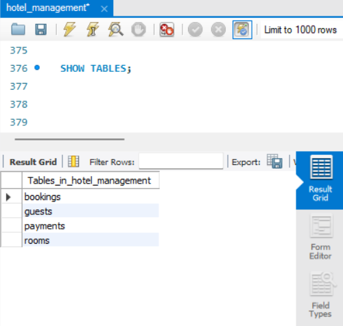
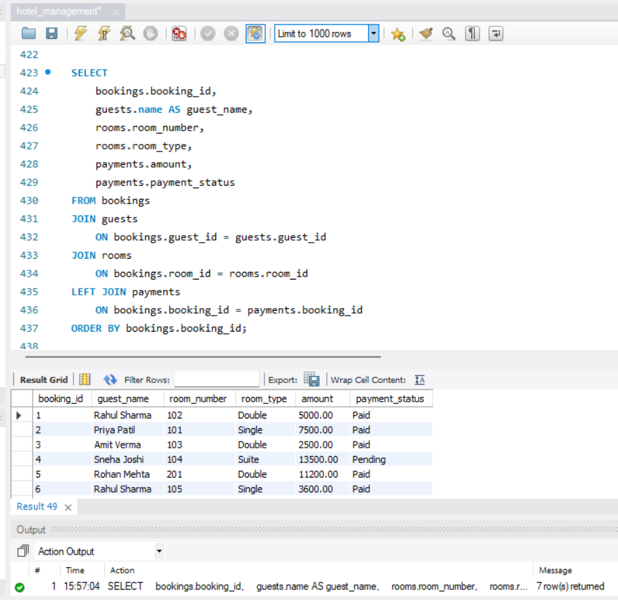
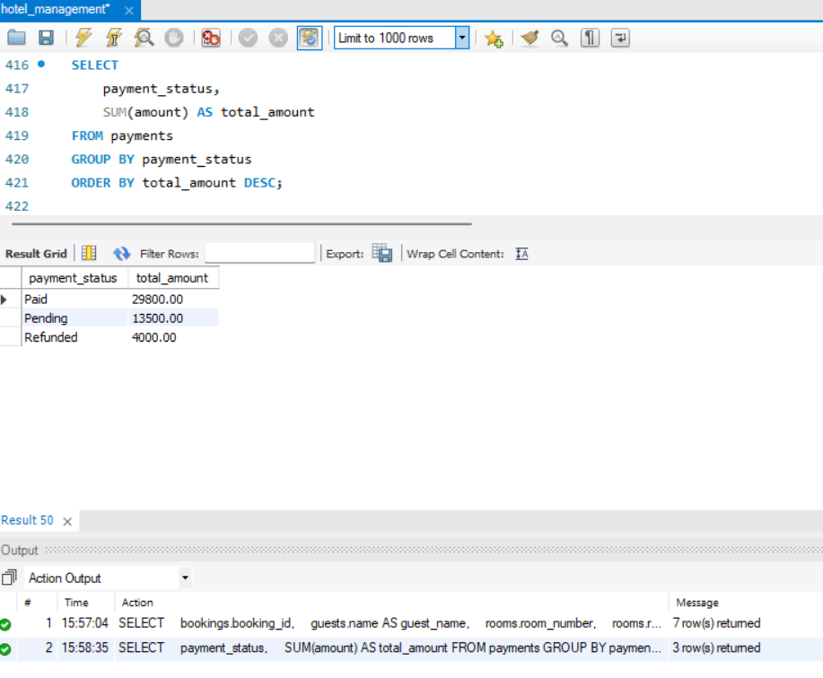

# Hotel Management Database System

## Objective

Designed a relational hotel management database using MySQL to manage guests, rooms, bookings, and payments.

## Technologies

- MySQL

## Database Tables

- Guests
- Rooms
- Bookings
- Payments

## Key SQL Concepts

- Primary Keys
- Foreign Keys
- JOINs
- WHERE and HAVING
- GROUP BY
- Aggregate Functions
- Data Validation
- Sorting and Filtering

## Project Features

- Guest information management
- Room availability tracking
- Booking management
- Payment tracking
- Revenue calculation
- Booking duration calculation
- Payment validation
- Booking and payment reporting

## Project Screenshots

### Database Tables

### Booking, Guest, Room and Payment Query

### Payment Summary

